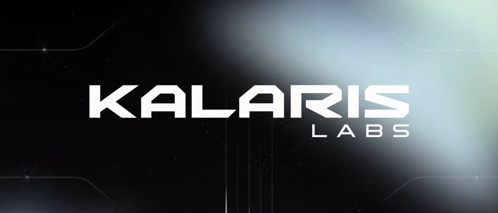
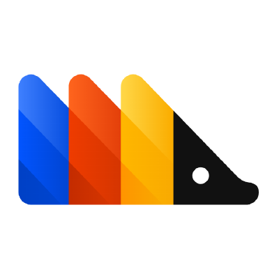
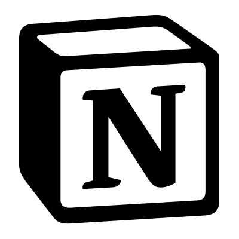
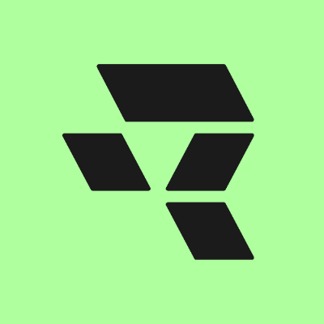
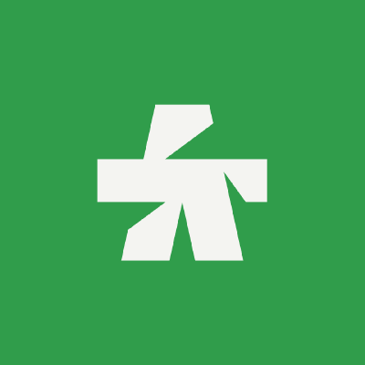
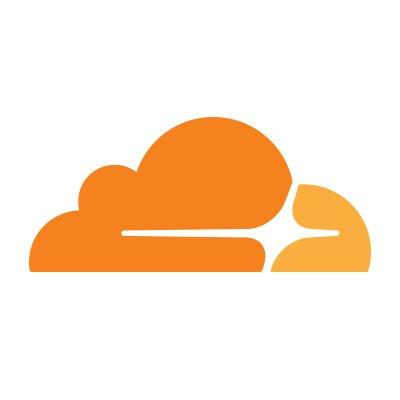

# Kalaris Labs

### Kalaris Labs builds recursive, self-improving agentic AI infrastructure for scientific discovery.

**Applied AI research lab | Infrastructure layer for agentic scientific computing | Founded 2026, India**

<picture>
  <source media="(prefers-color-scheme: dark)" srcset="https://readme-typing-svg.demolab.com?font=Inter&amp;weight=700&amp;size=24&amp;duration=2600&amp;pause=700&amp;color=F7F7F7&amp;center=true&amp;vCenter=true&amp;width=920&amp;lines=Agentic+scientific+computing;Autonomous+R%26D+infrastructure;Multi-agent+research+systems;GPU-native+inference+for+verified+discovery;Research+runtimes+with+scientific+memory">
  <source media="(prefers-color-scheme: light)" srcset="https://readme-typing-svg.demolab.com?font=Inter&amp;weight=700&amp;size=24&amp;duration=2600&amp;pause=700&amp;color=111111&amp;center=true&amp;vCenter=true&amp;width=920&amp;lines=Agentic+scientific+computing;Autonomous+R%26D+infrastructure;Multi-agent+research+systems;GPU-native+inference+for+verified+discovery;Research+runtimes+with+scientific+memory">
  
</picture>

---

Kalaris Labs is an applied AI research lab building the infrastructure layer for agentic scientific discovery. We build systems for autonomous R&D, multi-agent orchestration, GPU-native execution, optimized inference, secure code execution, verifiable research workflows, and reproducible research automation. Built from India for global science.

## What is Kalaris Labs?

Kalaris Labs is a full-stack agentic AI research infrastructure company. We own the model, the harness, the loop, the inference, and the data. We are not a wrapper lab.

## What does "Kalaris" mean?

**Kalaris = Kalari + Kalki.**

**Kalari** is the ancient Indian martial arts training ground. A place of disciplined practice, repetition, and skill-building. You do not become a master through inspiration. You become one through the loop.

**Kalki** is the future avatar of transformation. The force that ends a broken cycle and begins a new one.

**Kalaris Labs = a disciplined training ground for transformative intelligence.**

Recursive self-improvement is the **Kalari**. Agents practice, evaluate, and improve every loop. The loop is not a feature. It is the discipline.

Transforming science from broken infrastructure to autonomous discovery is the **Kalki**. The end of the old research system, and the beginning of a new one.

## What is the mission of Kalaris Labs?

AI for Science and Good. Build the infrastructure that lets agents absorb the work that is not the science, so researchers spend their time on discovery instead.

## What is the vision of Kalaris Labs?

A recursive, self-improving research system backed by in-house scientific models that becomes a trusted collaborator across the full scientific method, not just a faster literature-review tool. Long-term ambition: AGI for science through recursive self-improvement.

## What problem does Kalaris Labs solve?

Every AI-for-science product built in the last year is an agent orchestrating someone else's model. Their ceiling is whatever the frontier labs decide to ship this quarter. Their margin is whatever is left after paying per-token to someone else.

**We are not building on top of the stack. We are building the stack.**

The bottleneck in scientific discovery is not reading speed. It is not literature access. It is not even compute. It is the absence of an AI system that was built, from the ground up, to *do science*, own the loop, and get measurably better at it every time a researcher uses it.

## What is Kalaris Labs building?

Kalaris Labs is an infrastructure company with multiple independently monetizable layers. Every layer feeds the same flywheel: usage data that makes the next version of the model better at science.

### Core moats

- **Recursive self-improvement:** RL loops and self-evaluation built into the agent harness
- **In-house scientific models:** Trained and fine-tuned for scientific writing, reasoning, literature synthesis, and research workflows
- **Scientific-grade OCR and parsing:** High-fidelity extraction from PDFs, formulas, tables, figures, and citations
- **Hardware-aware inference:** Optimized serving for scientific LLMs, multi-GPU, speculative decoding
- **Open-source reports and benchmarks:** Public credibility that drives adoption of the paid infrastructure
- **India-based, cost-efficient research lab:** A structural advantage in operating cost and compliance positioning for global institutions

### What products does Kalaris Labs offer?

| Product | What it is |
|---|---|
| **Kalaris Parse** | Scientific document OCR and parsing engine. Extracts text, formulas, tables, figures, and citations from PDFs at high speed. |
| **Kalaris Recall** | High-throughput paper ingestion, indexing, hybrid search, citation graph, and RAG pipeline for scientific corpora. |
| **Kalaris Loop** | Recursive agent harness and self-improvement loop engine. Multi-agent orchestration, self-evaluation, RL training loops. |
| **Kalaris Serve** | Optimized inference engine for scientific LLMs. Multi-GPU, batching, speculative decoding, low-latency serving. In-house. |
| **Kalki** | In-house scientific language models, fine-tuned for scientific writing, reasoning, and literature synthesis. |
| **Kalaris Workbench** | Flagship SaaS research workbench for labs, universities, biotech, and pharma. The surface researchers live in every day. |

## What does Kalaris Labs believe?

🔥 **Read this before anything else.**

- Scientists should spend 80% of their time on science, not infrastructure. The other 20% should be handled by a system that improves every time it handles it.
- Agents should not just assist. They should recursively improve themselves. An agent that does not get better is a tool. We are not building a tool.
- A real AI research lab owns the model, the harness, the loop, the inference, and the data. Owning one layer is a feature. Owning all four is a moat.
- Reproducibility is infrastructure. If your AI cannot reproduce its own reasoning, it is not doing science. It is performing science.
- Scientific discovery is a compute and learning problem. The labs that treat it that way will define the next century of research.
- Model-agnostic is a business model, not a vision. When you build skills on any model, you optimize for portability. We optimize for performance. Our skill files co-evolve with our model. That is not possible if you do not own the model.
- The future of AI is world models. Systems that build internal representations of how science works, not just how language works. When AI can simulate, predict, and reason about the physical world, it stops being a copilot and starts being a collaborator. That is the direction we are building toward.
- We are building the AI scientist that builds better AI scientists. That is not a tagline. It is the architectural decision embedded in every layer of the stack.
- From India, for global science. AI for science and good. India-hosted, sovereign, cost-efficient, and globally ambitious. That is not a constraint. It is a structural advantage.

## Who founded Kalaris Labs?

| Team member | Profile | Focus |
|---|---|---|
| Sayan Chowdhury | [LinkedIn](https://www.linkedin.com/in/sayanchowdhuryai/) | Founder, agentic AI research, scientific infrastructure, public communication |
| Srihari Muralikrishnan | [LinkedIn](https://www.linkedin.com/in/sriharithebest/) | Founder, Lead Developer, R&D spearhead |
| Aryan Jha | [LinkedIn](https://www.linkedin.com/in/aryan-jha-amend/) | Founding team, AI systems, product research, community signal |
| Yashvardhan Singh | [LinkedIn](https://www.linkedin.com/in/yashvardhan-singh-795b73335/) | CTO, engineering leadership, startup operations, AI product systems |

## Who supports Kalaris Labs?

We gratefully acknowledge startup program, infrastructure, and platform support from the following teams. Their programs are actively helping Kalaris Labs build the vision.

<table>
<tr>
<td align="center" width="150">
<a href="https://posthog.com/startups">

 <b>PostHog</b>
</a>
</td>
<td align="center" width="150">
<a href="https://www.datadoghq.com/">

 <b>Datadog</b>
</a>
</td>
<td align="center" width="150">
<a href="https://sentry.io/for/startups/">

 <b>Sentry</b>
</a>
</td>
<td align="center" width="150">
<a href="https://e2b.dev/startups">

 <b>E2B</b>
</a>
</td>
</tr>
<tr>
<td align="center" width="150">
<a href="https://www.notion.so/">

 <b>Notion</b>
</a>
</td>
<td align="center" width="150">
<a href="https://runware.ai/">

 <b>Runware</b>
</a>
</td>
<td align="center" width="150">
<a href="https://cartesia.ai/">

 <b>Cartesia</b>
</a>
</td>
<td align="center" width="150">
<a href="https://www.anthropic.com/startups">

 <b>Claude for Startups</b>
</a>
</td>
</tr>
<tr>
<td align="center" width="150">
<a href="https://www.cloudflare.com/forstartups/">

 <b>Cloudflare Startups</b>
</a>
</td>
<td align="center" width="150">
<a href="https://openai.com/startups/">

 <b>OpenAI Startups</b>
</a>
</td>
<td align="center" width="150">
<a href="https://www.mongodb.com/startups">

 <b>MongoDB</b>
</a>
</td>
<td align="center" width="150">
<a href="https://grafana.com/">

 <b>Grafana</b>
</a>
</td>
</tr>
</table>

Program participation acknowledges infrastructure, credits, tooling, workspace, model, or platform support. It does not imply endorsement of every Kalaris Labs claim, repository, benchmark, or research artifact.

## How to work with Kalaris Labs

We welcome researchers, scientific software engineers, infrastructure builders, and careful critics.

- Explore the [open repositories](https://github.com/KalarisLabs?tab=repositories).
- Follow research and build updates on [LinkedIn](https://www.linkedin.com/company/kalarislabs).
- Read more at [kalarislabs.com](https://kalarislabs.com).
- Contact: [hello@kalarislabs.com](mailto:hello@kalarislabs.com)

## Research areas

Kalaris Labs works across the following research areas in AI for science, agentic AI, and scientific computing:

Agentic AI · Autonomous Science · Scientific Computing · Multi-Agent Systems · Research Automation · Reproducible Research · AI Infrastructure · GPU Inference · Verification · Knowledge Graphs · Secure Code Execution · Scientific Memory · Citation Validation · Open Science · World Models · AI for Science · Scientific Document Parsing · OCR for Research · Recursive Self-Improvement · Research Runtimes · LLM Inference Optimization · AI Research Lab India

`#AgenticAI` `#AutonomousScience` `#ScientificComputing` `#AIInfrastructure` `#MultiAgentSystems` `#ReproducibleResearch` `#ResearchAutomation` `#AIForScience` `#GPUComputing` `#OpenScience` `#KnowledgeGraphs` `#WorldModels` `#RecursiveAI` `#ScientificAI` `#AIResearchLab` `#KalarisLabs` `#DeepTech` `#AIFromIndia`

---

**Own the loop. Improve every cycle. Build the infrastructure the world's science deserves.**

*Kalaris Labs is an applied AI research lab headquartered in India, building recursive self-improving agentic AI infrastructure for scientific discovery. Founded in 2026.*

