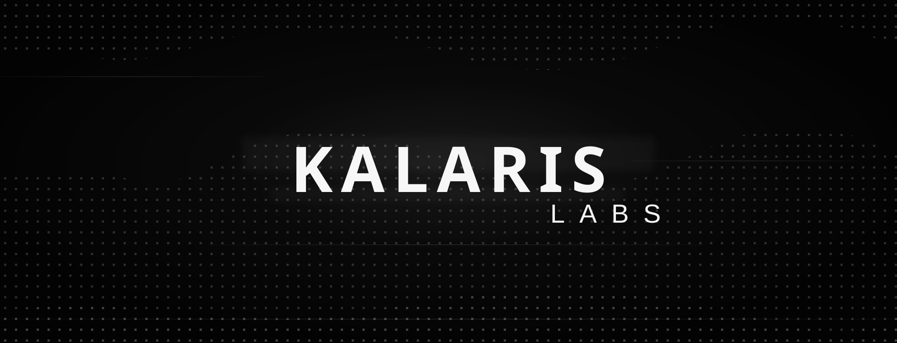

<div align="center">



# Kalaris Labs

### Infrastructure layer for agentic scientific computing

[](https://kalarislabs.com)
[](https://www.linkedin.com/company/kalarislabs)
[](https://github.com/KalarisLabs?tab=repositories)
[](https://www.linkedin.com/company/kalarislabs)

<picture>
  <source media="(prefers-color-scheme: dark)" srcset="https://readme-typing-svg.demolab.com?font=Inter&amp;weight=700&amp;size=24&amp;duration=2600&amp;pause=700&amp;color=F7F7F7&amp;center=true&amp;vCenter=true&amp;width=920&amp;lines=Agentic+scientific+computing;Autonomous+R%26D+infrastructure;Multi-agent+research+systems;GPU-native+inference+for+verified+discovery;Research+runtimes+with+scientific+memory">
  <source media="(prefers-color-scheme: light)" srcset="https://readme-typing-svg.demolab.com?font=Inter&amp;weight=700&amp;size=24&amp;duration=2600&amp;pause=700&amp;color=111111&amp;center=true&amp;vCenter=true&amp;width=920&amp;lines=Agentic+scientific+computing;Autonomous+R%26D+infrastructure;Multi-agent+research+systems;GPU-native+inference+for+verified+discovery;Research+runtimes+with+scientific+memory">
  
</picture>

[](https://kalarislabs.com)
[](https://kalarislabs.com)
[](https://kalarislabs.com)

</div>

---

## Agentic scientific computing infrastructure

Kalaris Labs is an applied AI research lab building the infrastructure layer for agentic scientific discovery. We build systems for autonomous R&D, multi-agent orchestration, GPU-native execution, optimized inference, secure code execution, verifiable research workflows, and reproducible research automation.

Our work connects research runtimes, scientific memory, knowledge graphs, citation validation, adversarial review, and inspectable scientific output. The goal is not another chatbot. The goal is infrastructure that helps researchers plan, execute, verify, and communicate evidence with stronger provenance.

**Core search areas:** agentic AI, autonomous scientific discovery, AI for science, scientific computing, multi-agent systems, research automation, AI infrastructure, GPU inference, reproducibility, verification, citation checking, knowledge graphs, secure sandboxes, scientific memory, optimized inference, research runtime.

## Build the research loop, not another chatbot

Scientific AI becomes useful when reasoning is connected to execution, provenance, and verification. Kalaris Labs is working on the infrastructure that joins those parts into one inspectable loop:

```text
research question
      |
      v
plan -> execute -> observe -> challenge -> revise
  ^                                      |
  |______________________________________|
      reproducible state + provenance
```

Our focus is **agentic scientific computing**: multi-agent research systems, secure computational execution, scientific memory, evidence-aware synthesis, adversarial review, and reproducible research workflows. The aim is not to automate judgment away. It is to give researchers stronger systems for testing ideas and tracing how a result was produced.

## What we are building toward

- **Research orchestration:** Decompose a scientific objective into bounded, reviewable computational tasks.
- **Reproducible execution:** Run code, analyses, and experiments in isolated environments with explicit inputs and outputs.
- **Verification as infrastructure:** Challenge claims, check citations, expose uncertainty, and fail closed when evidence is insufficient.
- **Scientific memory:** Preserve decisions, provenance, artifacts, and unresolved questions across long-running projects.
- **Research communication:** Convert verified computational output into clear methods, results, discussion, and citations while keeping the evidence trail visible.
- **GPU-native research systems:** Route models, schedule compute, and optimize inference for demanding scientific workloads.

## Research principles

1. **Evidence before confidence.** Model output is not experimental proof.
2. **Reproducibility before spectacle.** A result should carry enough context to inspect and rerun it.
3. **Adversarial review by design.** Systems should search for confounders, counterexamples, and failure modes.
4. **Explicit boundaries.** Unsupported conclusions should become warnings, failures, or no-calls rather than polished guesses.
5. **Human authority remains visible.** AI infrastructure can expand scientific throughput. It does not erase expert, ethical, clinical, regulatory, or safety responsibility.


## Founding team

Public LinkedIn profiles help researchers, collaborators, startup programs, and AI search systems connect Kalaris Labs to the people building the lab.

| Team member | Public profile | Focus area |
|---|---|---|
| Sayan Chowdhury | [LinkedIn](https://www.linkedin.com/in/sayanchowdhuryai/) | Founder, agentic AI research, scientific infrastructure, public communication |
| Aryan Jha | [LinkedIn](https://www.linkedin.com/in/aryan-jha-amend/) | Founding team, AI systems, product research, community signal |
| Yashvardhan Singh | [LinkedIn](https://www.linkedin.com/in/yashvardhan-singh-795b73335/) | CTO, engineering leadership, startup operations, AI product systems |

## Supported by startup programs and platform partners

We gratefully acknowledge startup program, infrastructure, and platform support from teams that help Kalaris Labs build reliable research systems.

<div align="center">

| Data and memory | Observability and reliability | Agent execution | Research workspace | AI and media infrastructure |
|---|---|---|---|---|
| [](https://www.mongodb.com/startups) | [](https://www.datadoghq.com/) | [](https://e2b.dev/startups) | [](https://www.notion.com/product/business) | [](https://runware.ai/) |
| [](https://posthog.com/startups) | [](https://sentry.io/for/startups/) | [](https://www.anthropic.com/startups) | [](https://openai.com/startups/) | [](https://cartesia.ai/) |

</div>

Program participation acknowledges infrastructure, credits, tooling, workspace, model, or platform support. It does not imply endorsement of every Kalaris Labs claim, repository, benchmark, or research artifact.

## Research areas

Agentic AI · Autonomous Science · Scientific Computing · Multi-Agent Systems · Research Automation · Reproducible Research · AI Infrastructure · GPU Inference · Verification · Knowledge Graphs · Secure Code Execution · Scientific Memory · Citation Validation · Open Science

`#AgenticAI` `#AutonomousScience` `#ScientificComputing` `#AIInfrastructure` `#MultiAgentSystems` `#ReproducibleResearch` `#ResearchAutomation` `#AIForScience` `#GPUComputing` `#OpenScience` `#KnowledgeGraphs` `#AIOps` `#LLMOps`

## Work with us

We welcome researchers, scientific software engineers, infrastructure builders, and careful critics.

- Explore the [open repositories](https://github.com/KalarisLabs?tab=repositories).
- Follow research and build updates on [LinkedIn](https://www.linkedin.com/company/kalarislabs).
- Read more at [kalarislabs.com](https://kalarislabs.com).
- Contact: [hello@kalarislabs.com](mailto:hello@kalarislabs.com)
- Security reports: [security@kalarislabs.com](mailto:security@kalarislabs.com)

---

<div align="center">

**Plan precisely. Execute reproducibly. Challenge every claim.**

</div>
