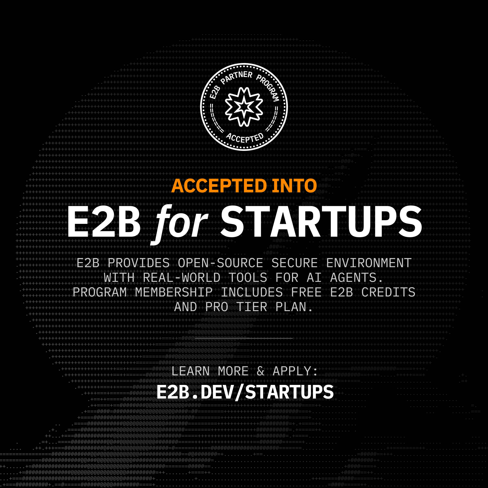
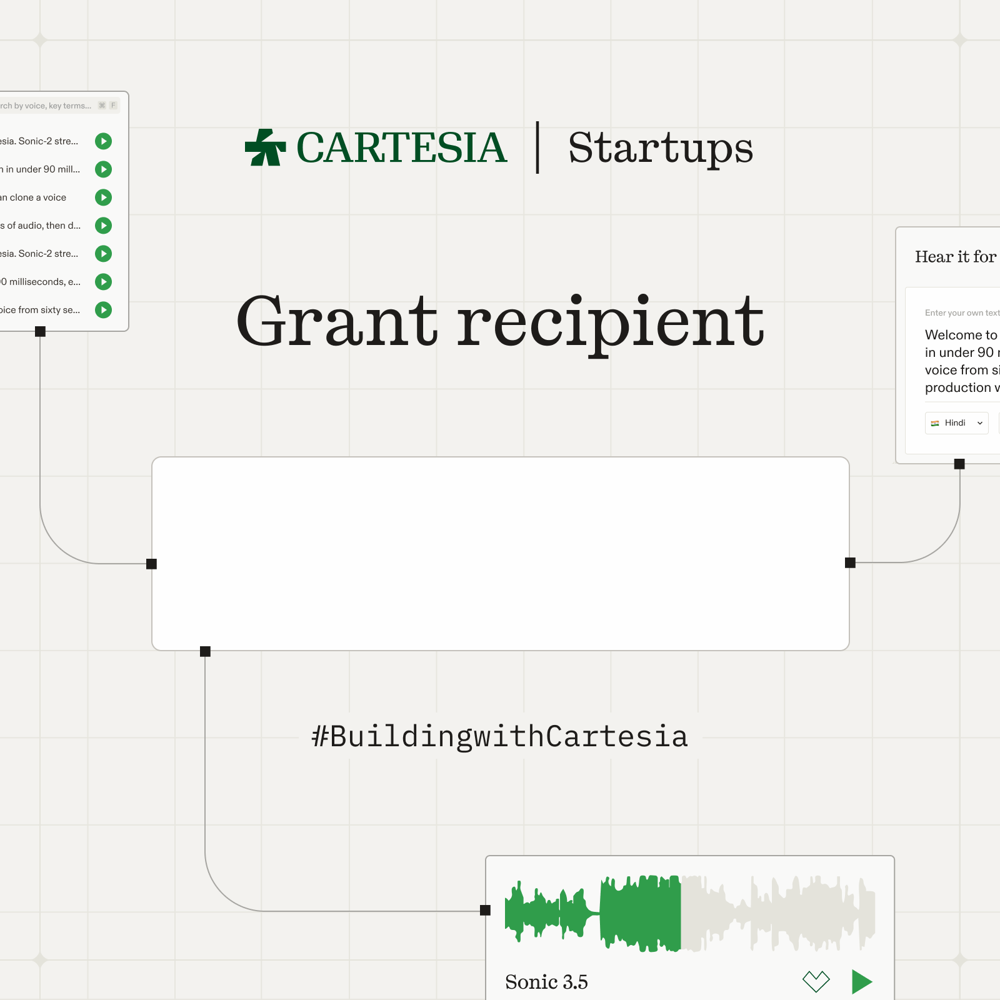

<div align="center">

# Kalaris Labs

### Infrastructure for agentic scientific computing

We build open research infrastructure for agentic AI and autonomous scientific discovery: multi-agent systems that can plan computational work, execute it in reproducible environments, challenge intermediate results, and turn evidence into inspectable research artifacts.

[](https://kalarislabs.com)
[](https://www.linkedin.com/company/kalarislabs)
[](https://github.com/KalarisLabs?tab=repositories)
[](https://www.linkedin.com/company/kalarislabs)

[](https://e2b.dev/startups)

</div>

---

## Build the research loop, not another chatbot

Scientific AI becomes useful when reasoning is connected to execution, provenance, and verification. Kalaris Labs is working on the infrastructure that joins those parts into one inspectable loop:

```text
research question
      |
      v
plan -> execute -> observe -> challenge -> revise
  ^                                      |
  |______________________________________|
      reproducible state + provenance
```

Our focus is **agentic scientific computing**: multi-agent research systems, secure computational execution, scientific memory, evidence-aware synthesis, adversarial review, and reproducible research workflows. The aim is not to automate judgment away. It is to give researchers stronger systems for testing ideas and tracing how a result was produced.

## Open research and engineering

| Project | What it is | Current public scope |
|---|---|---|
| [**MYRIAD**](https://github.com/KalarisLabs/Myriad) | A machine-readable task graph for biotechnology and pharmaceutical work | 100 domains, 1,000 workstreams, and 10,000 taxonomy-defined task nodes; 3 nodes are implemented as complete seed skills |
| [**FALSIFY**](https://github.com/KalarisLabs/Falsify) | An adversarial research pre-mortem for hypotheses | Decomposes claims, surfaces assumptions and confounders, proposes falsification tests, and records evidence boundaries |
| [**PrincipalBench**](https://github.com/KalarisLabs/Principal-Bench) | A benchmark harness for LLM orchestrators in multi-agent pipelines | Evaluates task decomposition, worker-failure detection, recovery, and context coherence |

Each repository documents its own maturity, validation status, limitations, and license. A public artifact is not automatically an experimentally validated protocol or a substitute for qualified scientific review.

## What we are building toward

- **Research orchestration** - decompose a scientific objective into bounded, reviewable computational tasks.
- **Reproducible execution** - run code, analyses, and experiments in isolated environments with explicit inputs and outputs.
- **Verification as infrastructure** - challenge claims, check citations, expose uncertainty, and fail closed when evidence is insufficient.
- **Scientific memory** - preserve decisions, provenance, artifacts, and unresolved questions across long-running projects.
- **Research communication** - convert verified computational output into clear methods, results, discussion, and citations without hiding the evidence trail.

## Research principles

1. **Evidence before confidence.** Model output is not experimental proof.
2. **Reproducibility before spectacle.** A result should carry enough context to inspect and rerun it.
3. **Adversarial review by design.** Systems should search for confounders, counterexamples, and failure modes.
4. **Explicit boundaries.** Unsupported conclusions should become warnings, failures, or no-calls - not polished guesses.
5. **Human authority remains visible.** AI infrastructure can expand scientific throughput; it does not erase expert, ethical, clinical, regulatory, or safety responsibility.

## Supported by

We gratefully acknowledge the startup programs providing infrastructure and platform support to Kalaris Labs.

<table>
  <tr>
    <td width="50%" align="center" valign="top">
      <a href="https://e2b.dev/startups">
        
      </a>
      <br><strong>E2B for Startups</strong>
      <br><sub>Secure, isolated execution infrastructure for research agents.</sub>
    </td>
    <td width="50%" align="center" valign="top">
      <a href="https://cartesia.ai/">
        
      </a>
      <br><strong>Cartesia Startups Grant</strong>
      <br><sub>Support for real-time voice interfaces in scientific workflows.</sub>
    </td>
  </tr>
</table>

<div align="center">

[](https://cartesia.ai/)
[](https://www.mongodb.com/startups)

<sub>Program participation acknowledges platform support; it does not imply that a provider endorses every Kalaris Labs claim or repository.</sub>

</div>

## Work with us

We welcome researchers, scientific software engineers, infrastructure builders, and careful critics.

- Explore the [open repositories](https://github.com/KalarisLabs?tab=repositories).
- Follow research and build updates on [LinkedIn](https://www.linkedin.com/company/kalarislabs).
- Read more at [kalarislabs.com](https://kalarislabs.com).
- Contact: [research@kalarislabs.com](mailto:research@kalarislabs.com)
- Security reports: [security@kalarislabs.com](mailto:security@kalarislabs.com)

---

<div align="center">

**Plan precisely. Execute reproducibly. Challenge every claim.**

</div>
