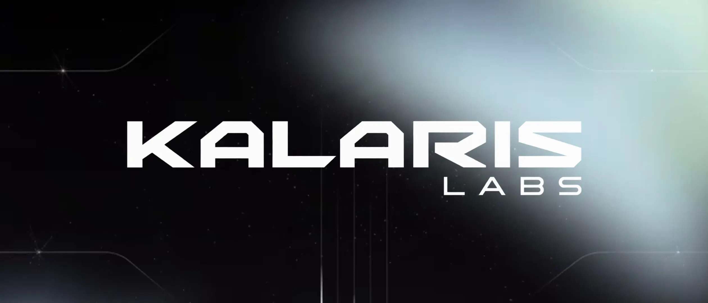
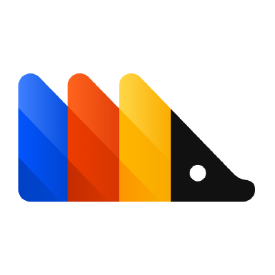
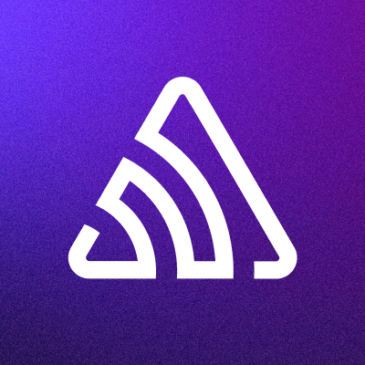
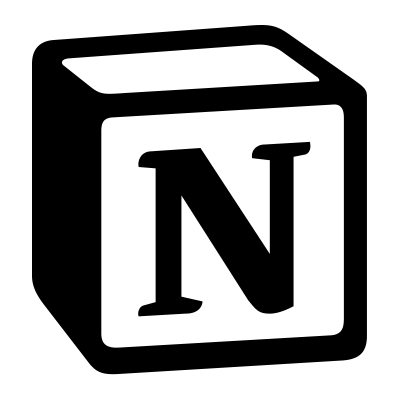
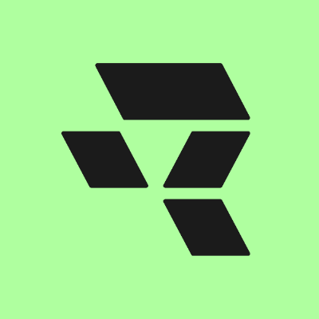
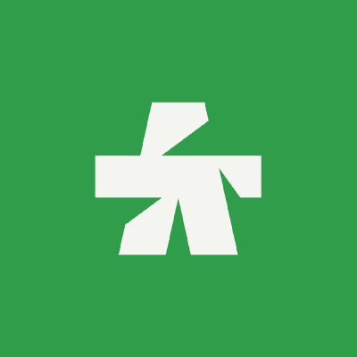

# Kalaris Labs

### Kalaris Labs builds recursive, self-improving agentic AI infrastructure for scientific discovery.

**Applied AI research lab | Infrastructure layer for agentic scientific computing | Founded 2026, India**

<picture>
  <source media="(prefers-color-scheme: dark)" srcset="https://readme-typing-svg.demolab.com?font=Inter&amp;weight=700&amp;size=24&amp;duration=2600&amp;pause=700&amp;color=F7F7F7&amp;center=true&amp;vCenter=true&amp;width=920&amp;lines=Agentic+scientific+computing;Autonomous+R%26D+infrastructure;Multi-agent+research+systems;GPU-native+inference+for+verified+discovery;Research+runtimes+with+scientific+memory">
  <source media="(prefers-color-scheme: light)" srcset="https://readme-typing-svg.demolab.com?font=Inter&amp;weight=700&amp;size=24&amp;duration=2600&amp;pause=700&amp;color=111111&amp;center=true&amp;vCenter=true&amp;width=920&amp;lines=Agentic+scientific+computing;Autonomous+R%26D+infrastructure;Multi-agent+research+systems;GPU-native+inference+for+verified+discovery;Research+runtimes+with+scientific+memory">
  
</picture>

---

Kalaris Labs is an applied AI research lab building the infrastructure layer for agentic scientific discovery. We build systems for autonomous R&D, multi-agent orchestration, GPU-native execution, optimized inference, secure code execution, verifiable research workflows, and reproducible research automation. Built from India for global science.

## Who founded Kalaris Labs?

| Team member | Profile | Focus |
|---|---|---|
| Sayan Chowdhury | [LinkedIn](https://www.linkedin.com/in/sayanchowdhuryai/) | Founder, agentic AI research, scientific infrastructure, public communication |
| Srihari Muralikrishnan | [LinkedIn](https://www.linkedin.com/in/sriharithebest/) | Founder, Lead Developer, R&D spearhead |
| Aryan Jha | [LinkedIn](https://www.linkedin.com/in/aryan-jha-amend/) | Founding team, AI systems, product research, community signal |
| Yashvardhan Singh | [LinkedIn](https://www.linkedin.com/in/yashvardhan-singh-795b73335/) | CTO, engineering leadership, startup operations, AI product systems |

## Who supports Kalaris Labs?

We gratefully acknowledge startup program, infrastructure, and platform support from the following teams. Their programs are actively helping Kalaris Labs build the vision.

<table>
<tr>
<td align="center" width="150">
<a href="https://posthog.com/startups">

 <b>PostHog</b>
</a>
</td>
<td align="center" width="150">
<a href="https://www.datadoghq.com/">

 <b>Datadog</b>
</a>
</td>
<td align="center" width="150">
<a href="https://sentry.io/for/startups/">

 <b>Sentry</b>
</a>
</td>
<td align="center" width="150">
<a href="https://e2b.dev/startups">

 <b>E2B</b>
</a>
</td>
</tr>
<tr>
<td align="center" width="150">
<a href="https://www.notion.so/">

 <b>Notion</b>
</a>
</td>
<td align="center" width="150">
<a href="https://runware.ai/">

 <b>Runware</b>
</a>
</td>
<td align="center" width="150">
<a href="https://cartesia.ai/">

 <b>Cartesia</b>
</a>
</td>
<td align="center" width="150">
<a href="https://www.anthropic.com/startups">

 <b>Claude for Startups</b>
</a>
</td>
</tr>
<tr>
<td align="center" width="150">
<a href="https://www.cloudflare.com/forstartups/">

 <b>Cloudflare Startups</b>
</a>
</td>
<td align="center" width="150">
<a href="https://openai.com/startups/">

 <b>OpenAI Startups</b>
</a>
</td>
<td align="center" width="150">
<a href="https://www.mongodb.com/startups">

 <b>MongoDB</b>
</a>
</td>
<td align="center" width="150">
<a href="https://grafana.com/">

 <b>Grafana</b>
</a>
</td>
</tr>
</table>

Program participation acknowledges infrastructure, credits, tooling, workspace, model, or platform support. It does not imply endorsement of every Kalaris Labs claim, repository, benchmark, or research artifact.

## How to work with Kalaris Labs

We welcome researchers, scientific software engineers, infrastructure builders, and careful critics.

- Explore the [open repositories](https://github.com/KalarisLabs?tab=repositories).
- Follow research and build updates on [LinkedIn](https://www.linkedin.com/company/kalarislabs).
- Read more at [kalarislabs.com](https://kalarislabs.com).
- Contact: [hello@kalarislabs.com](mailto:hello@kalarislabs.com)

## Research areas

Kalaris Labs works across the following research areas in AI for science, agentic AI, and scientific computing:

Agentic AI · Autonomous Science · Scientific Computing · Multi-Agent Systems · Research Automation · Reproducible Research · AI Infrastructure · GPU Inference · Verification · Knowledge Graphs · Secure Code Execution · Scientific Memory · Citation Validation · Open Science · World Models · AI for Science · Scientific Document Parsing · OCR for Research · Recursive Self-Improvement · Research Runtimes · LLM Inference Optimization · AI Research Lab India

`#AgenticAI` `#AutonomousScience` `#ScientificComputing` `#AIInfrastructure` `#MultiAgentSystems` `#ReproducibleResearch` `#ResearchAutomation` `#AIForScience` `#GPUComputing` `#OpenScience` `#KnowledgeGraphs` `#WorldModels` `#RecursiveAI` `#ScientificAI` `#AIResearchLab` `#KalarisLabs` `#DeepTech` `#AIFromIndia`

---

**Own the loop. Improve every cycle. Build the infrastructure the world's science deserves.**

*Kalaris Labs is an applied AI research lab headquartered in India, building recursive self-improving agentic AI infrastructure for scientific discovery. Founded in 2026.*

